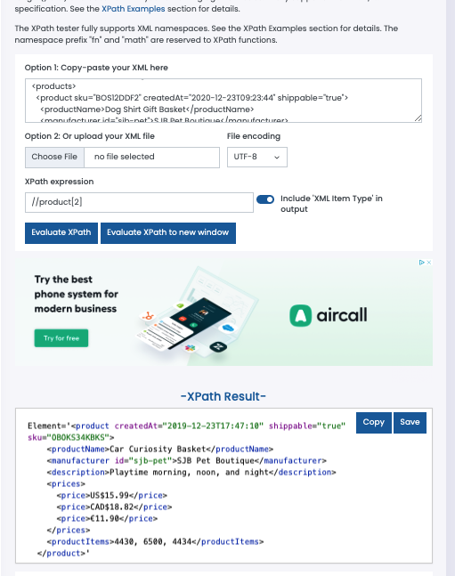
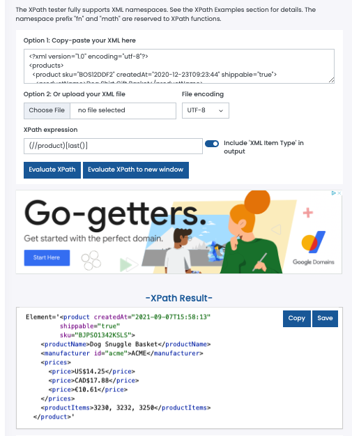
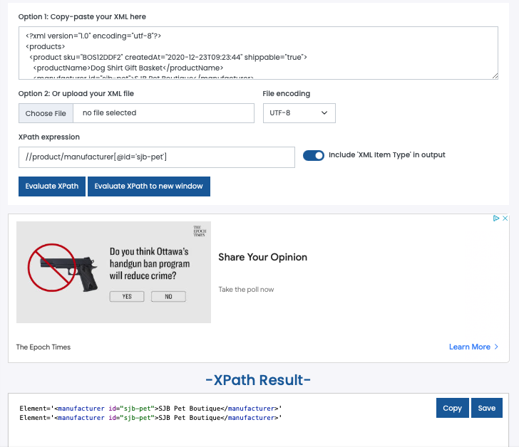

1. Target 2nd product in the list
   Ans 
   
2. Target last product in the list  
   Ans 

3. Target `sku` attribute of the first product  
   Ans 

4. Target all products with manufacturer id `sjb-pet`
   Ans 
