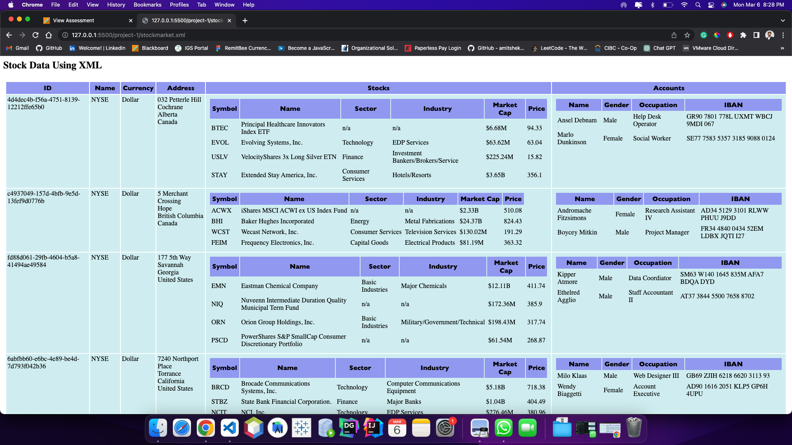
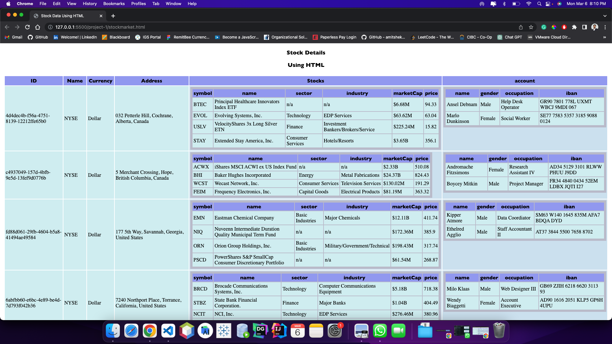

-   We have divided project 1 into 3 parts (Stock Market).

    1. Convert JSON into XML and Create dtd for created xml. - Ishan Joshi (N01491168)
    2. Create XSD and CSS - Deeya Chadha (N01553958)
    3. Create XSLT file, Create HTML file and code Refactor - Ravikumar Gelani (N01552823)

-   First, Create xslt to display data in the table format
    

-   Secondly, I have create HTML file and dynamically loaded the given XML data into this HTML using JS and displayed it in browser in a tabular form using the CSS as XSLT.
    
